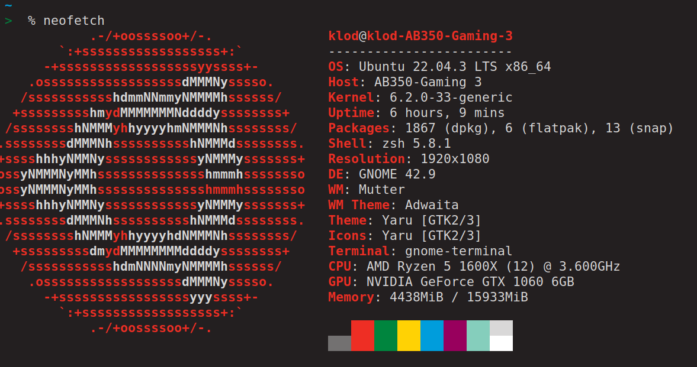

# My suckles configurations
In this repository there are all my suckless installations with relative configurations.

# How to install dwm (dinamic window manager) and st by suckless.org
## Dependecies

### Base Packages

```bash
$ sudo apt install libxft-dev libxinerama1 libxinerama-dev
```

### Used softwares
This configuration of `dwm`, that you can find in `config.h`, uses a bunch of
software in its keybindings and without these you will face some difficulties
using `dwm`. So make sure to install these software, **at least the terminal**,
before using it.

- **st**: _simple terminal_, is the terminal used in this configuration, opened
  by pressing `super+return` or `super+backpspace`. To
  install it check the README file inside the `st` directory.
- **dmenu**: it is a handy menu that can be used in multiple ways, in our
  configuration we use it to help the user search for given commands, to use it
  you have to press `super+p`. To
  install it check the README file inside the `dmenu` directory.

- **slock**: it is used to lock the screen, to use it press `super+shift+q`. To
  install it check the README file inside the `slock` directory.
- **dunst**: is a notification deamon, that is not used directly by `dwm`, but it is
set in the configuration settings `.xinitrc.sample`. To install it, run `sudo
apt install dunst`
- **xwallpaper**: this deamon enables to use an image as a wallpaper. To install
  it, run `sudo apt install xwallpaper`


## Installation
Each package have a README file with some information on the installation.
Before installing it, make sure to have compiled it, execute:
`sudo make clean install`.

For `dwm` you can choose different paths:

### Using xinitrc
Copy the ./custom/.xinitrc.sample file in the home directory and rename it in `.xinitrc`
```bash
$ cp custom/.xinitrc.sample ~/.xinitrc
```
Then you have to restart your machine.

### Using xsessions
Xsessions enables you to choose witch ever window manager you want to use, in the login screen.
You can run ./custom/install_session, with sudo authorizations, to automatically install the window manager, or you can do the spets needed by yourself:
- add the `statusbar` script, this will populate the status bar with the date, internet connection and other things.
```
$ cp custom/statusbar /usr/local/bin/
```
we put the script in the bin directory because it is present in the PATH, so we can use the `statusbar` script in our `dwm.desktop` file (described at the end).
If you want to add or modify the status bar you can edit the `statusbar` script.

- now we need to add the script that actually execute dwm in `/usr/local/bin/` directory, doing so we can execute the script wherever we are (becasue the bin directory is in PATH). Copy ./custom/.xinitrc.sample file in `/usr/local/bin/` and rename it in `startdwm`
```bash
$ cp custom/.xinitrc.sample /usr/local/bin/startdwm
```

- the last step consist in adding the dwm session to the windows manager selection (in order to select it in the login screen), copy ./custom/dwm.desktop file to `/usr/share/xsessions/`
```bash
$ cp custom/dwm.desktop /usr/share/xsessions/
```

---
I personally did the second option because with ubuntu (and two accounts) the first method didn't work.

## Add wallpaper
(in the install_session script it will be installed the default wallpaper, to change it you have to change the `~/.config/wallpaper.png` file)

If you want to use a wallpaper you have to install `xwallpaper` and designate a location to store the image you want to use a wallpaper, this location will be used by `xwallpaper` to render the image.

In order to make the wallpaper persistent after each login we put the xwallpaper command in the .xinitrc or startdwm file, and the path of the image is `~/.config/wallpaper.png`


# Configuration
To configure a suckless package you need to edit the `config.h` file and then compile it (`sudo make clean install`)


# Termial settings

- cursor blinking: No
- cursors chape: block
- font: Monospace
- font-size: 16

## Colors
### Normal
  black = "#231f20", \
  red = "#ee2e24", \
  green = "#00853e", \
  yellow = "#ffd204", \
  blue = "#009ddc", \
  magenta = "#98005d", \
  cyan = "#85cebc", \
  white = "#d9d8d8", \

### Bright
  black = "#737171", \
  red = "#ee2e24", \
  green = "#00853e", \
  yellow = "#ffd204", \
  blue = "#009ddc", \
  magenta = "#98005d", \
  cyan = "#85cebc", \
  white = "#ffffff", \

### Special
  background = "#231f20", \
  foreground = "#d9d8d8", \

  cursor (background) = "#e49b1b",
  cursor (foreground) = "#231f20",
